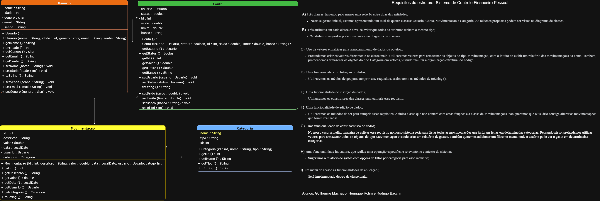

# Trabalho Final - Fundamentos de Programação
#### Turma 034 - 2026/1
#### Disciplina: Fundamentos de Programação
#### Professora: Aline Campos

## Integrantes
|Integrantes     |Matrícula |
|---|---|
|Guilherme Machado|24200740  |
|Henrique Rolim   |25280332  |
|Rodrigo Bacchin  |25200604  |

## Descrição Geral do Sistema

O projeto consiste em um Sistema de Controle Financeiro Pessoal desenvolvido em Java, com o objetivo de auxiliar o usuário no gerenciamento de receitas, despesas, categorias e movimentações financeiras.

O sistema é executado em terminal e utiliza conceitos de Programação Orientada a Objetos, como classes, objetos, composição, vetores de objetos, métodos, estruturas condicionais e estruturas de repetição, aplicando os conteúdos estudados na disciplina.

## Objetivos
- Registrar receitas e despesas.
- Organizar movimentações por categoria.
- Consultar informações financeiras.
- Gerar relatórios de gastos.
- Auxiliar o usuário no controle financeiro pessoal.
- Aplicar os conceitos estudados na disciplina.

## Primeiros Passos
### 1. Antes de começar a programar, atualize sua cópia local:
```bash
git pull origin main
```
Isso evita conflitos com alterações feitas por outros integrantes.

### 2. Compilar o projeto
```bash
javac *.java
```
Se não aparecer nenhuma mensagem de erro, a compilação foi realizada com sucesso.

### 3. Executar o sistema
```bash
java Main
```
O menu principal será exibido no terminal.

### 4. Salvar alterações
Após concluir uma funcionalidade:
```bash
git add .
git commit -m "Descrição da alteração"
git push origin main
```

# Diagrama de Classes



## Explicação do Diagrama

O sistema foi modelado utilizando Programação Orientada a Objetos.

A classe Usuario representa o usuário do sistema.

A classe Conta possui uma relação de composição com Usuario, pois cada conta pertence a um usuário.

A classe Categoria representa os tipos de receitas e despesas cadastradas.

A classe Movimentacao possui composição com Conta e Categoria, pois toda movimentação pertence a uma conta e utiliza uma categoria previamente cadastrada.

A classe GerenciadorCategorias é responsável por controlar o cadastro, busca, edição e listagem das categorias.

Link do vídeo: https://www.youtube.com/watch?v=Uc4kiNaFOBI

---

# Estrutura do Projeto

## Classes Principais

### Usuario

Representa o usuário do sistema.

**Atributos:**
- nome
- idade
- genero

### Conta
Representa uma conta financeira pertencente a um usuário.

**Atributos**
- usuario
- status
- id
- saldo
- limite
- banco

**Composição**
- Uma conta pertence a um usuário.

### Categoria
Representa uma categoria de movimentação financeira.

**Atributos**
- nome
- tipo
- observacoes

### Movimentação
Representa uma movimentação financeira.

**Atributos**
- conta
- data
- id
- categoria
- valor
- observacoes

**Composição**
- Uma movimentação pertence a uma conta.
- Uma movimentação pertence a uma categoria.

### GerenciadorCategorias
Responsável pelo gerenciamento das categorias cadastradas.
**Funcionalidades:**
- Cadastro de categoria
- Listagem de categorias
- Busca de categoria
- Edição de categoria

# Funcionalidades Implementadas

Atualmente o sistema possui:

- Cadastro de categorias;
- Listagem de categorias;
- Busca de categorias;
- Edição de categorias.
- Gerador de relatório


# Funcionalidade Inovadora

O sistema contará com um relatório financeiro mensal.

A funcionalidade calculará automaticamente:

- total de receitas;
- total de despesas;
- saldo do período;
- categoria responsável pelo maior gasto.

Esse recurso permitirá ao usuário visualizar rapidamente sua situação financeira.

# Fontes de Consulta

Durante o desenvolvimento foram utilizadas as seguintes fontes:

- https://docs.oracle.com/javase/tutorial/
- https://www.w3schools.com/java/
- https://stackoverflow.com/
- https://github.com/
- Material disponibilizado pela professora na disciplina.

---

# Uso de Inteligência Artificial

## Ferramentas Utilizadas

- ChatGPT
- Codex

## Exemplos de Prompts Utilizados

Durante o desenvolvimento foram utilizados prompts como:

- "Me dê ideias de temas para um projeto de fundamentos de programação"
- "Como implementar cadastro utilizando vetores de objetos em Java?"
- "Como implementar busca e edição de categorias em Java?"

## Utilização das Respostas

As sugestões fornecidas pelas ferramentas de IA foram analisadas pelos integrantes.

Parte das estruturas de classes e métodos foi adaptada para atender aos requisitos da disciplina.

Algumas sugestões foram descartadas por utilizarem recursos proibidos no trabalho, como ArrayList e coleções da linguagem.

## Finalidade

A ferramenta foi utilizada como apoio para:

- Dar ideias para o tema do projeto
- esclarecimento de dúvidas sobre Java;
- revisão de código;
- sugestões de estrutura de classes;
- auxílio na criação da documentação.

## Verificação das Respostas

Todo código sugerido foi analisado, adaptado e testado pelos integrantes antes de ser incorporado ao projeto.

Nenhuma resposta foi utilizada sem validação prévia.

---

# Divisão de Tarefas

## Guilherme Machado

- Desenvolvimento do menu principal.
- Integração das funcionalidades.
- Desenvolvimento Diagrama.
- Implementação do filtro.

## Henrique Rolim

- Desenvolvimento do gerenciamento de categorias.
- Implementação do cadastro, listagem, busca e edição de categorias.
- Elaboração da documentação.
- Desenvolvimento do README.

## Rodrigo Bacchin

- Desenvolvimento das funcionalidades relacionadas às movimentações e contas.
- Formatação do código.
- Revisão do Diagrama.

---

# Dificuldades Encontradas

Durante o desenvolvimento foram encontradas dificuldades relacionadas à organização da estrutura do projeto, integração do código entre os integrantes e utilização correta do Git para controle de versões.

Essas dificuldades foram superadas por meio da divisão clara de responsabilidades, realização de testes frequentes e comunicação constante entre os membros da equipe.

---

# Lições Aprendidas

O desenvolvimento do projeto permitiu consolidar conhecimentos sobre:

- Programação Orientada a Objetos;
- Classes e objetos;
- Composição entre classes;
- Vetores de objetos;
- Métodos;
- Estruturas de repetição;
- Estruturas condicionais;
- Controle de versões com Git e GitHub;
- Trabalho colaborativo em equipe.

Além dos conhecimentos técnicos, o projeto reforçou a importância da organização do código, da documentação e da comunicação entre os integrantes durante o desenvolvimento de software.
